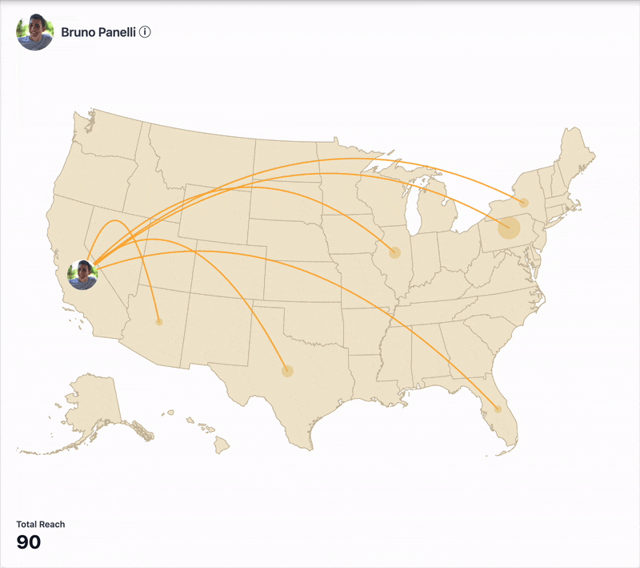

# Pray - Dynamic Impact Map

Backend stored in the back folder.

Frontend stored in the front folder.

-----

## Dynamic Impact Map Specification

## Feature Name
Dynamic Impact Map

## Short Description
The Dynamic Impact Map is an interactive visualization tool that showcases a Pastor's cumulative engagement across the United States. It displays the flow of engagement from the Pastor's headquarters to various states, providing a representation of their impact and reach.

## User Story
As a Pastor using Pray Studio, I want to visualize my cumulative engagement across the United States so that I can understand my impact, identify areas of strong influence, and discover potential growth opportunities for my digital ministry.

## Acceptance Criteria
1. The map displays the United States with state boundaries clearly visible.
2. The Pastor's headquarters location is prominently marked on the map.
3. Cumulative engagement data is displayed for the entire nation and individual states.
4. The map displays engagement data from an API providing the engagement events.
5. The visualization is responsive and works on various screen sizes.

## Technical Specification

### Frontend
1. Implement a React component for the Dynamic Impact Map.
2. Use a map library (e.g., react-simple-maps or react-usa-map) to render the USA map.
3. Develop a mechanism to fetch new engagement data every minute.
4. Ensure the component is responsive and works on different screen sizes.

### Backend
1. Develop a RESTful API endpoint to provide up to 300 engagement data values

## API Endpoint suggestion
- path: GET /api/pastors/{pastorId}/impact-map
- engagement data structure:
  - id: unique identifier
  - timestamp: date and time of the engagement
  - state: two-letter state code

## Extra Credit
1. Implement animated lines connecting the Pastor's HQ to areas of engagement.
2. Add pulsing dots that travel along the lines to represent individual engagement events.

## References that may help
1. React Simple Maps: https://www.react-simple-maps.io/
2. React USA Map: https://www.npmjs.com/package/react-usa-map
3. SVG Animations: https://developer.mozilla.org/en-US/docs/Web/SVG/SVG_animation_with_SMIL
4. Node.js Best Practices: https://github.com/goldbergyoni/nodebestpractices
